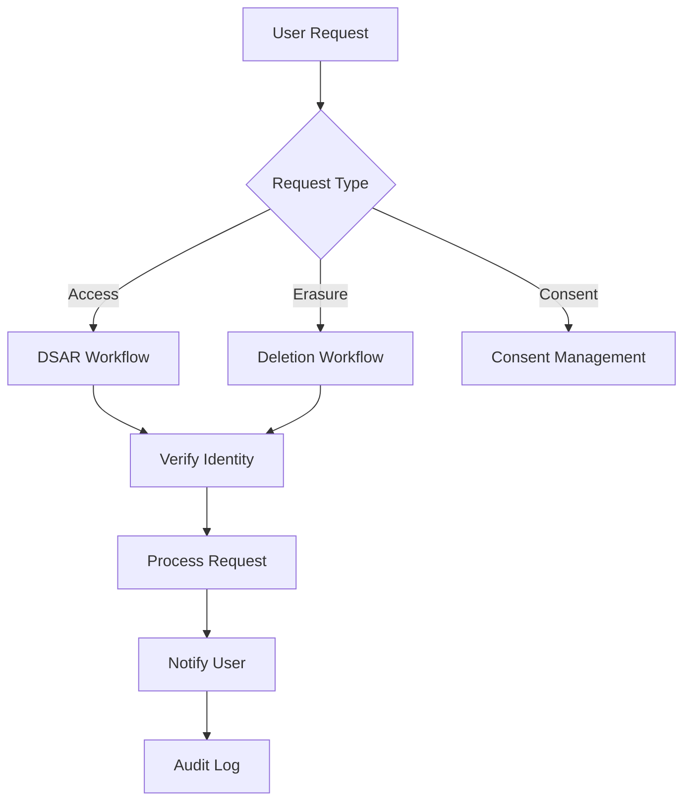

# Product Requirements Document (PRD) - Gdpr Module

**Module**: Gdpr
**Version**: 1.0
**Status**: Draft
**Last Updated**: 2026-03-12
**Author**: Product Team

---

## Document Control

| Version | Date | Author | Changes |
|---------|------|--------|---------|
| 1.0 | 2026-03-12 | Product Team | Initial draft |

---

## 1. Executive Summary

### 1.1 Problem Statement
> GDPR and privacy regulations require comprehensive data protection measures including consent management, data subject rights, privacy controls, and audit trails. Without a dedicated GDPR compliance module, platforms risk regulatory fines, legal liability, and user trust erosion. Manual compliance processes are error-prone, difficult to audit, and don't scale. The platform needs automated, comprehensive GDPR compliance tools to manage consent, handle data requests, and maintain privacy-by-design.

### 1.2 Proposed Solution
> The Gdpr module provides comprehensive GDPR compliance tools including consent management, data subject access requests (DSAR), right to erasure, data portability, privacy preference center, cookie consent, data processing records, and automated compliance workflows. It integrates with all modules to ensure data protection across the platform and provides admin tools for managing compliance operations.

### 1.3 Business Value Proposition
- **Primary Value**: Automated GDPR compliance reducing legal risk and operational burden
- **Secondary Value**: User trust through transparent privacy controls
- **Strategic Alignment**: Regulatory compliance, trust and safety, global market access

### 1.4 Success Metrics (High-Level)
| Metric | Current | Target | Timeline |
|--------|---------|--------|----------|
| Consent Coverage | N/A | 100% of processing | Q2 2026 |
| DSAR Response Time | N/A | <30 days | Q2 2026 |
| Compliance Score | N/A | 95%+ | Q3 2026 |
| User Trust Score | N/A | 4.5/5 | Q3 2026 |

---

## 2. Goals & Objectives

### 2.1 Primary Goals (SMART)
1. **Specific**: Implement comprehensive consent management and data subject rights automation
2. **Measurable**: Achieve 100% consent coverage, <30 day DSAR response time
3. **Achievable**: Leverage existing User, Activity modules for integration
4. **Relevant**: Critical for EU market access and regulatory compliance
5. **Time-bound**: Core compliance by Q2 2026, advanced features by Q3 2026

### 2.2 Secondary Goals
- Implement privacy impact assessments
- Build data retention automation
- Create compliance reporting dashboard
- Develop vendor management tools

### 2.3 Non-Goals
> What this module will NOT do (scope boundaries)
- Legal advice or interpretation (requires legal counsel)
- Non-GDPR regulations without adaptation (e.g., CCPA, LGPD)
- Data security infrastructure (handled by security systems)

### 2.4 Key Results (OKRs)
| Objective | Key Result | Target | Status |
|-----------|------------|--------|--------|
| Compliance Excellence | Compliance audit score | 95%+ | Pending |
| User Rights | DSAR fulfillment time | <30 days | Pending |
| Consent Management | Valid consent rate | 100% | Pending |
| Transparency | Privacy policy acceptance | 100% | Pending |

---

## 3. Target Users

### 3.1 User Personas

#### Persona 1: Data Protection Officer
| Attribute | Details |
|-----------|---------|
| Role | DPO/Compliance Officer |
| Goals | Ensure GDPR compliance, manage data requests |
| Pain Points | Manual processes, lack of visibility, audit complexity |
| Technical Level | Intermediate |
| Usage Frequency | Daily |

**User Story**:
> As a Data Protection Officer, I want to manage and audit all data processing activities, so that I can ensure GDPR compliance and respond to regulatory inquiries.

#### Persona 2: End User (Data Subject)
| Attribute | Details |
|-----------|---------|
| Role | Platform User |
| Goals | Control personal data, exercise privacy rights |
| Pain Points | Complex privacy settings, difficult to request data |
| Technical Level | Basic |
| Usage Frequency | Monthly |

**User Story**:
> As an End User, I want to easily access, export, or delete my personal data, so that I can control my privacy and exercise my rights.

#### Persona 3: System Administrator
| Attribute | Details |
|-----------|---------|
| Role | Platform Admin |
| Goals | Configure consent, manage compliance settings |
| Pain Points | Complex compliance configuration, manual tracking |
| Technical Level | Advanced |
| Usage Frequency | Weekly |

**User Story**:
> As a System Administrator, I want to configure and monitor GDPR settings centrally, so that I can maintain compliance across the platform.

### 3.2 Use Cases
| ID | Use Case | Actor | Trigger | Outcome |
|----|----------|-------|---------|---------|
| UC-001 | Give consent | User | First use/feature access | Consent recorded |
| UC-002 | Withdraw consent | User | Privacy preference change | Consent revoked |
| UC-003 | Request data access | User | DSAR submission | Data exported |
| UC-004 | Request erasure | User | Right to be forgotten | Data deleted |
| UC-005 | Manage cookies | User | Cookie banner | Cookie preferences set |
| UC-006 | Audit compliance | DPO | Compliance review | Audit report |

### 3.3 Pain Points Addressed
| Pain Point | Severity | How Solved |
|------------|----------|------------|
| Manual compliance processes | High | Automated workflows |
| DSAR fulfillment complexity | High | Automated data export/deletion |
| Consent tracking | High | Centralized consent management |
| Audit difficulty | Medium | Comprehensive audit logs |
| User trust | Medium | Transparent privacy controls |

---

## 4. Functional Requirements

### 4.1 Requirements Matrix

| ID | Requirement | Description | Priority | Acceptance Criteria |
|----|-------------|-------------|----------|---------------------|
| FR-001 | Consent Management | Capture, store, manage user consent | P0 | Granular consent |
| FR-002 | Data Access Requests | Automated DSAR fulfillment | P0 | Complete data export |
| FR-003 | Right to Erasure | Delete user data on request | P0 | Complete deletion |
| FR-004 | Data Portability | Export data in standard format | P0 | JSON/CSV export |
| FR-005 | Cookie Consent | Cookie banner and preferences | P0 | Cookie compliance |
| FR-006 | Privacy Center | User privacy preference hub | P1 | Self-service portal |
| FR-007 | Processing Records | Record of processing activities | P1 | ROPA documentation |
| FR-008 | Data Retention | Automated retention policies | P1 | Auto-deletion |
| FR-009 | Breach Notification | Data breach workflow | P2 | Breach tracking |
| FR-010 | Compliance Dashboard | Admin compliance monitoring | P1 | Real-time dashboard |
| FR-011 | Vendor Management | Data processor tracking | P2 | Vendor registry |
| FR-012 | Privacy Impact Assessment | DPIA workflow | P3 | Assessment tool |

### 4.2 Priority Definitions
- **P0 (Critical)**: Must have for launch - consent, DSAR, erasure, cookies
- **P1 (High)**: Should have - privacy center, retention, dashboard
- **P2 (Medium)**: Nice to have - breach notification, vendor management
- **P3 (Low)**: Future consideration - DPIA, advanced features

### 4.3 Feature Details

#### Feature 1: Consent Management
**Description**: Comprehensive consent capture, storage, and management with granular controls for different processing purposes.

**User Flow**:
```
1. User encounters consent request (signup, feature access)
2. Presented with clear, specific consent options
3. User provides explicit consent (opt-in)
4. Consent recorded with timestamp, purpose, version
5. User can withdraw consent anytime via Privacy Center
6. Withdrawal triggers data processing cessation
```

**Acceptance Criteria**:
- [ ] Granular consent by processing purpose
- [ ] Explicit opt-in (no pre-ticked boxes)
- [ ] Consent version tracking
- [ ] Withdrawal mechanism
- [ ] Consent audit trail
- [ ] Minor consent handling (age verification)

**Dependencies**: User Module, Activity Module

#### Feature 2: Data Subject Access Requests
**Description**: Automated DSAR workflow for collecting, exporting, and delivering user data.

**Acceptance Criteria**:
- [ ] DSAR request submission
- [ ] Identity verification
- [ ] Automated data collection from all modules
- [ ] Data export in JSON/CSV format
- [ ] Secure delivery mechanism
- [ ] 30-day deadline tracking
- [ ] Request status tracking

**Dependencies**: All Modules (data sources)

#### Feature 3: Right to Erasure
**Description**: Automated data deletion workflow honoring the right to be forgotten.

**Acceptance Criteria**:
- [ ] Erasure request submission
- [ ] Identity verification
- [ ] Legal basis check (exceptions apply)
- [ ] Coordinated deletion across modules
- [ ] Deletion confirmation
- [ ] Audit trail
- [ ] Backup handling

**Dependencies**: All Modules (data deletion)

---

## 5. Non-Functional Requirements

### 5.1 Performance Requirements
| Metric | Requirement | Measurement |
|--------|-------------|-------------|
| DSAR Processing | <30 days | Regulatory requirement |
| Data Export Time | <1 hour | For typical user |
| Consent Check | <10ms | Per request |
| Erasure Completion | <7 days | For typical user |
| Availability | 99.9% | Monthly uptime |

### 5.2 Security Requirements
- [x] Authentication for all privacy functions
- [x] Identity verification for DSAR/erasure
- [x] Data encryption at rest and in transit
- [x] Secure data export delivery
- [x] Audit logging for all actions
- [x] Access control for admin functions

### 5.3 Scalability Requirements
- Support for 100,000+ consent records
- Efficient data collection for DSAR
- Batch processing for erasure
- Retention policy automation

### 5.4 Compliance Requirements
- [x] GDPR (full compliance)
- [x] ePrivacy Directive (cookies)
- [ ] CCPA (with configuration)
- [ ] LGPD (with configuration)

---

## 6. User Experience

### 6.1 User Flows


### 6.2 Wireframes
> [Links to Figma/Sketch wireframes - to be created]

### 6.3 Design Principles
- Clear, transparent privacy communications
- Easy-to-use privacy controls
- Accessible to all users
- Trust-building design

### 6.4 Interaction Specifications
| Interaction | Behavior | Feedback |
|-------------|----------|----------|
| Give Consent | Check box, confirm | Confirmation message |
| Withdraw Consent | Toggle off | Update confirmation |
| Request Data | Submit form | Status tracking |
| Delete Account | Confirm deletion | Final warning, confirmation |

---

## 7. Technical Considerations

### 7.1 Architecture Overview
```
┌─────────────────────────────────────────────────────────┐
│                   Gdpr Module                           │
│  ┌──────────────┐  ┌──────────────┐  ┌──────────────┐  │
│  │ Consent      │  │ DSAR         │  │ Erasure      │  │
│  │ Management   │  │ Automation   │  │ Automation   │  │
│  └──────────────┘  └──────────────┘  └──────────────┘  │
│  ┌──────────────┐  ┌──────────────┐  ┌──────────────┐  │
│  │ Cookie       │  │ Privacy      │  │ Compliance   │  │
│  │ Consent      │  │ Center       │  │ Dashboard    │  │
│  └──────────────┘  └──────────────┘  └──────────────┘  │
└─────────────────────────────────────────────────────────┘
              │              │              │
              ▼              ▼              ▼
    ┌─────────────┐ ┌─────────────┐ ┌─────────────┐
    │   User      │ │  Activity   │ │   All       │
    │   Module    │ │   Module    │ │   Modules   │
    └─────────────┘ └─────────────┘ └─────────────┘
```

### 7.2 Dependencies
| Dependency | Type | Version | Criticality |
|------------|------|---------|-------------|
| Laravel | Framework | 12.x | Critical |
| Filament | UI Framework | 5.x | Critical |
| spatie/laravel-cookie-consent | Package | 2.x | High |
| spatie/laravel-activitylog | Package | 4.x | Medium |

### 7.3 Integration Points
| System | Integration Type | Data Flow | Frequency |
|--------|------------------|-----------|-----------|
| User Module | User Data | Bidirectional | Per request |
| All Modules | Data Collection | Inbound | Per DSAR |
| Activity Module | Audit Trail | Outbound | Per action |
| Email System | Notifications | Outbound | Per event |

### 7.4 Technical Constraints
- PHP 8.3+ required
- Laravel 12+ required
- Filament v5 compatibility
- Database: MySQL 8.0+

### 7.5 Database Schema
```sql
CREATE TABLE gdpr_consents (
    id BIGINT UNSIGNED AUTO_INCREMENT PRIMARY KEY,
    user_id BIGINT UNSIGNED,
    purpose VARCHAR(255),
    consent_type VARCHAR(100),
    is_given BOOLEAN DEFAULT FALSE,
    ip_address VARCHAR(45),
    user_agent VARCHAR(255),
    consent_version VARCHAR(20),
    created_at TIMESTAMP DEFAULT CURRENT_TIMESTAMP,
    updated_at TIMESTAMP DEFAULT CURRENT_TIMESTAMP ON UPDATE CURRENT_TIMESTAMP,
    
    INDEX idx_user (user_id),
    INDEX idx_purpose (purpose)
);

CREATE TABLE gdpr_requests (
    id BIGINT UNSIGNED AUTO_INCREMENT PRIMARY KEY,
    user_id BIGINT UNSIGNED,
    request_type ENUM('access', 'erasure', 'rectification', 'portability', 'restriction'),
    status ENUM('pending', 'in_progress', 'completed', 'rejected'),
    requested_at TIMESTAMP DEFAULT CURRENT_TIMESTAMP,
    completed_at TIMESTAMP NULL,
    response_data JSON,
    notes TEXT,
    
    INDEX idx_user (user_id),
    INDEX idx_status (status)
);

CREATE TABLE gdpr_processing_records (
    id BIGINT UNSIGNED AUTO_INCREMENT PRIMARY KEY,
    activity_name VARCHAR(255),
    purpose TEXT,
    data_categories JSON,
    retention_period VARCHAR(100),
    legal_basis VARCHAR(255),
    created_at TIMESTAMP DEFAULT CURRENT_TIMESTAMP,
    updated_at TIMESTAMP DEFAULT CURRENT_TIMESTAMP ON UPDATE CURRENT_TIMESTAMP
);
```

---

## 8. Analytics & Metrics

### 8.1 Success Metrics (KPIs)
| KPI | Definition | Target | Measurement Method |
|-----|------------|--------|-------------------|
| Consent Rate | % users with valid consent | 100% | Consent tracking |
| DSAR Fulfillment | Avg completion time | <30 days | Request tracking |
| Erasure Completion | Avg deletion time | <7 days | Request tracking |
| Compliance Score | Audit compliance % | 95%+ | Internal audit |
| User Trust | Privacy trust score | 4.5/5 | User surveys |

### 8.2 Tracking Requirements
- Consent grant/withdrawal rates
- DSAR volume and completion times
- Erasure request metrics
- Cookie consent rates
- Compliance audit results

### 8.3 Reporting Dashboards
- Consent overview and trends
- DSAR queue and status
- Compliance score by area
- Privacy request metrics
- Audit trail viewer

---

## 9. Go-to-Market

### 9.1 Launch Criteria
- [x] All P0 features complete
- [ ] Legal review completed
- [ ] Compliance audit passed
- [ ] Documentation complete
- [ ] DPO training completed

### 9.2 Marketing Requirements
- [ ] Privacy policy update
- [ ] User communication
- [ ] Cookie banner
- [ ] Trust and safety page

### 9.3 Sales Enablement
- [ ] Compliance documentation
- [ ] Security questionnaire responses
- [ ] GDPR compliance certificate

### 9.4 Customer Support Needs
- [ ] Privacy FAQ
- [ ] DSAR guide for users
- [ ] Admin training materials
- [ ] Compliance documentation

---

## 10. Timeline & Milestones

### 10.1 Key Dates
| Milestone | Date | Status |
|-----------|------|--------|
| Requirements Complete | 2026-03-12 | Complete |
| Design Complete | 2026-03-26 | Pending |
| Development Start | 2026-03-27 | Pending |
| Core Features (P0) | 2026-04-17 | Pending |
| Legal Review | 2026-04-24 | Pending |
| Beta Launch | 2026-05-01 | Pending |
| GA Launch | 2026-05-15 | Pending |

### 10.2 Phase Breakdown
**Phase 1: Discovery** (Weeks 1-2)
- GDPR requirements analysis
- Legal consultation
- Competitive analysis

**Phase 2: Design** (Weeks 3-4)
- Consent UX design
- Privacy center design
- Admin dashboard design

**Phase 3: Development** (Weeks 5-10)
- Sprint 1-2: Consent, DSAR
- Sprint 3-4: Erasure, cookies
- Sprint 5: Dashboard, polish

**Phase 4: Testing** (Weeks 11-12)
- QA testing
- Legal review
- Compliance audit

**Phase 5: Launch** (Week 13)
- Beta launch
- GA launch

### 10.3 Dependencies
| Dependency | On Whom | Due Date | Status |
|------------|---------|----------|--------|
| Legal Review | Legal Counsel | 2026-04-20 | Pending |
| User Module | User Team | 2026-04-01 | Pending |
| Activity Module | Activity Team | 2026-04-01 | Pending |

### 10.4 Risk Mitigation
| Risk | Probability | Impact | Mitigation |
|------|-------------|--------|------------|
| Non-compliance | Low | Critical | Legal review, audit |
| Data loss | Low | High | Backup verification |
| User confusion | Medium | Medium | Clear communications |

---

## 11. Open Questions

| ID | Question | Owner | Due Date | Status |
|----|----------|-------|----------|--------|
| Q-001 | Should we support CCPA out of the box? | Product | 2026-03-20 | Open |
| Q-002 | What is the consent refresh frequency? | Legal | 2026-03-20 | Open |
| Q-003 | Should erasure be immediate or delayed? | Legal | 2026-03-20 | Open |

---

## 12. Appendix

### 12.1 Glossary
| Term | Definition |
|------|------------|
| GDPR | General Data Protection Regulation |
| DSAR | Data Subject Access Request |
| Consent | User permission for data processing |
| DPO | Data Protection Officer |
| ROPA | Record of Processing Activities |
| DPIA | Data Protection Impact Assessment |

### 12.2 References
- [GDPR Text](https://gdpr.eu/)
- [ICO Guidelines](https://ico.org.uk/)
- [EDPB Guidelines](https://edpb.europa.eu/)

### 12.3 Related PRDs
- [User Module PRD](../User/docs/PRD.md)
- [Activity Module PRD](../Activity/docs/PRD.md)
- [Tenant Module PRD](../Tenant/docs/PRD.md)

---

## Approval

| Role | Name | Signature | Date |
|------|------|-----------|------|
| Product Manager | | | |
| Engineering Lead | | | |
| Design Lead | | | |
| Legal Counsel | | | |
| Stakeholder | | | |
